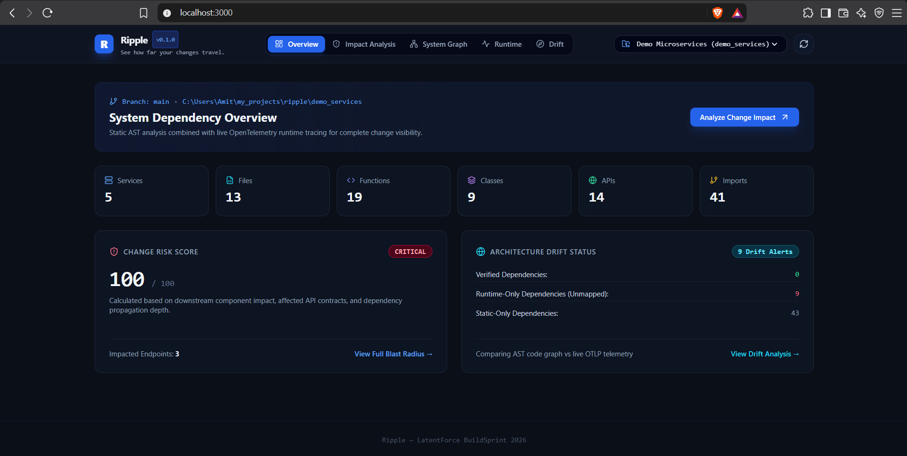
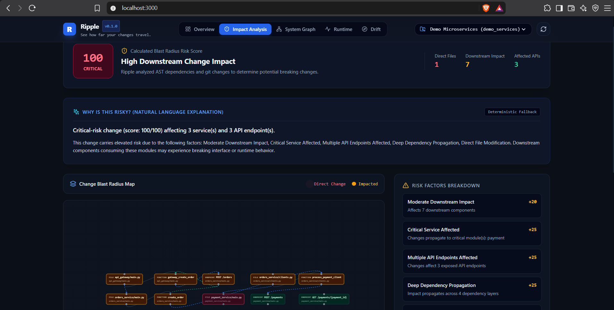
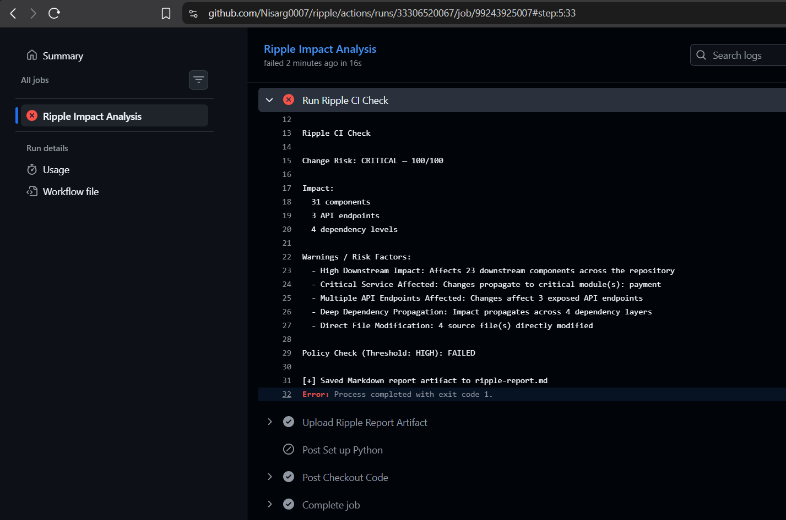
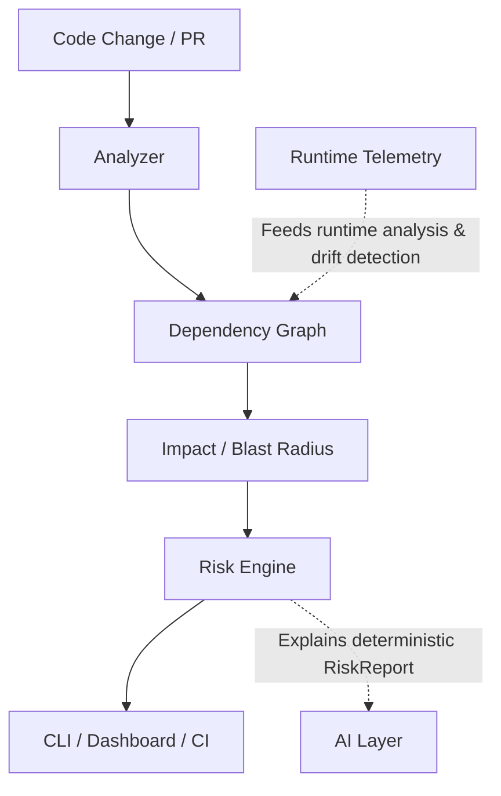
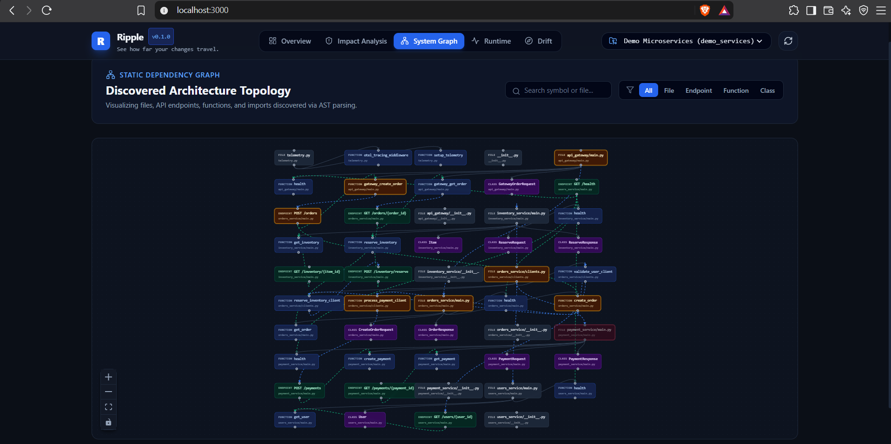
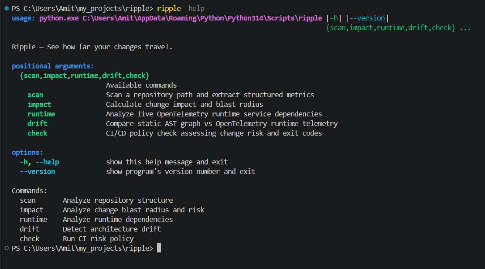

# Ripple

## See how far your changes travel.

Ripple is a developer tool that analyzes how code changes propagate through services, files, functions, and APIs. It combines static dependency analysis, runtime intelligence, deterministic risk scoring, architecture drift detection, and AI explanations to help developers understand the consequences of a change before it reaches production.



## Why Ripple?

A git diff tells developers what changed, but not necessarily what that change can affect across a dependency graph.

In modern services and APIs, a seemingly small change can propagate to downstream consumers. Ripple answers:

*"What else could this change affect?"*

## What Ripple Does

### 🔍 Change Impact

Trace how a code change propagates through files, functions, services, and APIs.



### 📊 Deterministic Risk Engine

Calculate a transparent risk score from explicit dependency and impact signals.

### ⚡ Runtime Intelligence

Analyze observed service-to-service runtime dependencies using OpenTelemetry.

### 🔀 Architecture Drift

Compare statically discovered dependencies with runtime-observed behavior.

### 🤖 AI Explanations

Turn the deterministic RiskReport into developer-friendly explanations.

*Note: AI does NOT determine the risk score. The deterministic RiskEngine remains the source of truth.*

### 🚦 Pull Request CI

Run Ripple during Pull Requests and fail according to a configurable risk threshold.



## Architecture





## The Demo

A developer changes the Payment API response contract: `amount` → `total` without updating its downstream consumer.

Ripple detects the affected API and dependency chain, calculates the resulting risk, and surfaces the blast radius through the CLI and dashboard. *(Note: This is the demonstration scenario and not necessarily the permanent state of the healthy demo repository).*

## Quick Start

Ripple currently runs locally and is not published to PyPI.

```bash
git clone https://github.com/Nisarg0007/ripple.git
cd ripple
python -m pip install -e .
```

Then you can use the CLI:

```bash
ripple --help
ripple scan demo_services
ripple impact demo_services
ripple check demo_services --fail-on high
```



## Pull Request CI

Ripple integrates with GitHub Actions to analyze Pull Requests and enforce risk thresholds before code is merged.

```bash
ripple check . --fail-on high
```

## Project Structure

These directories correspond to Ripple's major components:

- `analyzer/`
- `graph/`
- `risk_engine/`
- `runtime/`
- `ai/`
- `backend/`
- `frontend/`
- `cli/`
- `demo_services/`
- `tests/`

## Testing

The core application maintains a healthy automated test suite with **56 passed** tests verifying the graph, risk engine, and CLI layers. The React frontend production build has also been verified.

## Technology Stack

- **Core Analysis**: Python, NetworkX, GitPython, Pydantic
- **Backend API**: FastAPI
- **Frontend**: React, TypeScript, Vite, React Flow
- **Observability**: OpenTelemetry
- **CI**: GitHub Actions
- **AI**: Groq, NVIDIA NIM (with deterministic fallback)

## Built For

**LatentForce BuildSprint 2026**

Built using **LatentCode**.

---

### Created by

**Nisarg**
