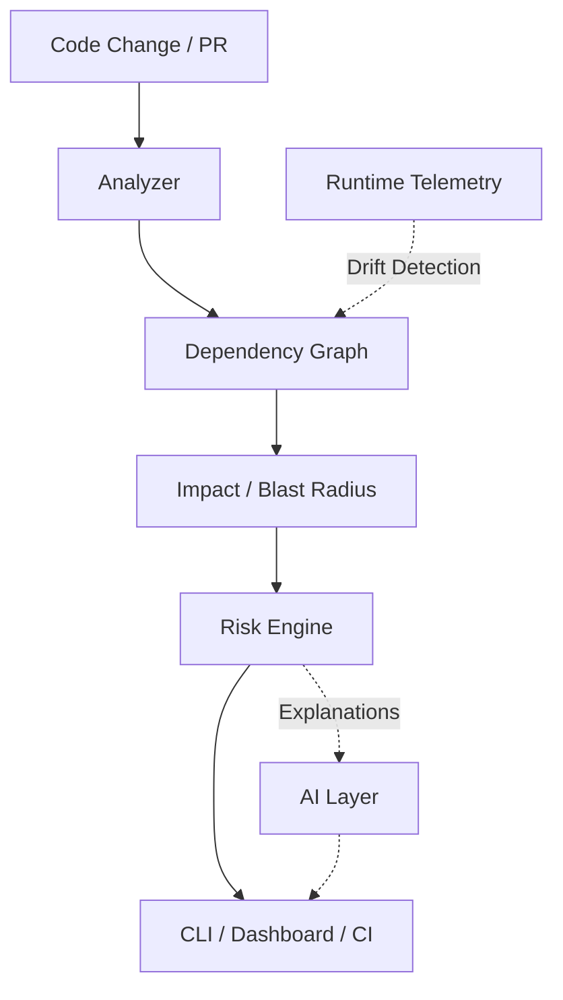

# 🌊 Ripple

## See how far your changes travel.

Ripple is a developer CLI tool and dashboard that helps software engineers understand the real downstream impact and risk of a code change before it reaches production.

### Why Ripple?

When engineers create Pull Requests, standard git diffs show line-by-line modifications within a localized context. However, in modern microservices, APIs, and shared libraries, local code edits often trigger unseen breaking changes across other services or dependent modules. Ripple solves this by building a deterministic dependency graph to show you the ripple effect of your changes.

### What it does

*   **🔍 Change Impact**: Trace how a code change propagates through services, files, functions, and APIs.
*   **📊 Risk Engine**: Deterministic risk scoring based on actual dependency impact.
*   **⚡ Runtime Intelligence**: Analyze observed service-to-service runtime dependencies.
*   **🔀 Architecture Drift**: Compare static architecture with runtime behavior.
*   **🤖 AI Explanations**: Explain deterministic risk findings in developer-friendly language.
*   **🚦 CI**: Run Ripple automatically on Pull Requests with configurable risk thresholds.

---

### Architecture



---

### Screenshots

> *Note: Add actual screenshots here.*
>
> 1.  [Placeholder: Impact Analysis dashboard]
> 2.  [Placeholder: System Graph]
> 3.  [Placeholder: Runtime / Drift]

---

### Quick Start

Clone the repository and install the CLI:

```bash
git clone https://github.com/your-org/ripple.git
cd ripple
python -m pip install -e .
```

Run Ripple on the demo services:

```bash
# View available commands
ripple --help

# Extract structural metrics
ripple scan demo_services

# Calculate change blast radius and risk
ripple impact demo_services

# CI policy check that fails on high risk
ripple check demo_services --fail-on high
```

---

### Built For

**LatentForce BuildSprint 2026**
Built using LatentCode.

### Technology Stack

*   **Core / CLI**: Python, NetworkX, GitPython, Pydantic
*   **Backend API**: FastAPI, Uvicorn, PostgreSQL, SQLAlchemy
*   **Frontend**: React, TypeScript, Vite, React Flow
*   **AI**: Google Gemini (with deterministic fallback)
